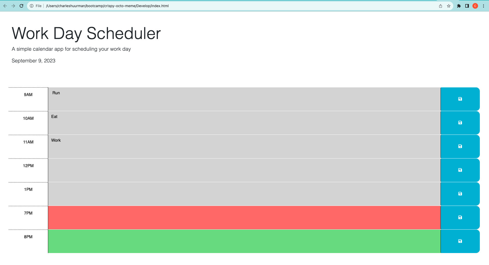

# Work Day Scheduler Starter Code

## Description

The Work Day Scheduler is a simple, intuitive tool designed to help users keep track of their daily commitments

- **Motivation**  
The aim was to create an easy-to-use tool to simplify daily planning. 

- **Why did you build this project?**   
I noticed that while there are many calendar apps available, few focus solely on the workday itself. By creating a tool centered on standard work hours, users can more efficiently plan their tasks without unnecessary clutter.

- **What problem does it solve?** 
This project offers a quick-glance solution for time management during standard business hours, making it easier to allocate time and prioritize tasks.

- **What did you learn?** 
I learned some skills in jQuery, DOM traversal, I practiced the local storage manipulation, and integrated third-party libraries like Day.js.

## Table of Contents 

If your README is long, add a table of contents to make it easy for users to find what they need.

- [Installation](#installation)
- [Usage](#usage)
- [License](#license)
- [Features](#features)

## Installation

To get the application running on your local machine:
1. Clone the repository from [GitHub](https://github.com/charleshuurman/challenge5.git).
2. Navigate to the project directory.
3. Open `index.html` in your preferred browser.
4. Ensure you have jQuery and Day.js libraries linked in your HTML.


## Usage

Follow this link: https://charleshuurman.github.io/challenge5/
1. Open the scheduler and observe the current day displayed at the top.
2. Scroll to view time blocks from 9am to 5pm.
3. Time blocks are color-coded:
Gray for past hours.
Red for the current hour.
Green for upcoming hours.
4. Click on a time block to enter an event.
5. Click the save button on the right to save the event.
6. Events persist even upon refreshing the page.

    ```md
    
    ```


## License

This project is licensed under the MIT License. 

## Features

- Time-Block Planning
- Dynamic Time-Based Coloring
- Persistent Task Storage

